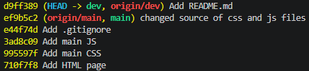

# Звіт до лабораторної роботи №1

## Тема

**Середовище розробки, Git і перша сторінка проєкту**

## Мета роботи

Налаштувати робоче середовище веброзробника, опанувати базовий цикл роботи з Git та GitHub і створити та опублікувати першу сторінку наскрізного проєкту

## Тема проєкту

**World Clock - годинник різних країн**

Проєкт являє собою вебзастосунок для перегляду поточного часу в різних містах світу. Користувач може вибрати місто зі списку та побачити його поточний час, дату

## Використані технології

* HTML
* CSS
* JavaScript
* Git
* GitHub
* GitHub Pages

## Структура проєкту

```text
world-clock/
├── index.html
├── README.md
├── .gitignore
|── js
|   └── script.js
|── css
|   └── style.css
|── docs/
|   └── report.md
└── images/
    └── commits.png
```

## Реалізована функціональність

1. Створено базову HTML-структуру сторінки
2. Додано заголовок та опис проєкту
3. Створено список міст за допомогою `<select>`
4. Реалізовано відображення поточного часу
5. Реалізовано відображення поточної дати
6. Додано відображення часового поясу вибраного міста
7. Реалізовано автоматичне оновлення часу кожну секунду
8. Додано адаптивне оформлення за допомогою CSS
9. Проєкт підготовлено до публікації через GitHub Pages

## Часові пояси

У проєкті використано часові пояси IANA:

* `Europe/Kyiv` - Київ
* `Europe/London` - Лондон
* `Europe/Paris` - Париж
* `Europe/Vienna` - Відень
* `America/New_York` - Нью-Йорк
* `America/Los_Angeles` - Лос-Анджелес
* `Asia/Tokyo` - Токіо
* `Asia/Shanghai` - Шанхай
* `Australia/Sydney` - Сідней

Для форматування часу в JavaScript використовується `Intl.DateTimeFormat`

## Робота з Git

Для контролю версій проєкту було створено Git-репозиторій.

Основні команди:

```bash
git clone
git status
git add
git commit
git branch
git push -u origin main
```

Ім'я та електронну пошту Git було налаштовано командами:

```bash
git config --global user.name 
git config --global user.email
```

## Історія комітів

Для демонстрації послідовної розробки передбачено щонайменше п'ять змістовних комітів:



Переглянути історію можна командою:

```bash
git log --oneline
```

## `.gitignore`

Файл `.gitignore` виключає службові та локальні файли:

```gitignore
node_modules/
.env
.git
```

Це запобігає випадковому додаванню до репозиторію залежностей, локальних налаштувань, логів та потенційно конфіденційних файлів

## Публікація через GitHub Pages

Після завантаження проєкту до GitHub його можна опублікувати через GitHub Pages:

```text
Settings → Pages
Source: Deploy from a branch
Branch: main
Folder: / (root)
```

### Посилання на GitHub-репозиторій

> https://github.com/DmytroHDY/world-clock

### Посилання на GitHub Pages

> https://dmytrohdy.github.io/world-clock/

## Перевірка роботи

Після публікації необхідно перевірити:

* чи відкривається `index.html`
* чи завантажуються CSS-стилі
* чи працює JavaScript
* чи змінюється час при виборі іншого міста
* чи оновлюється час кожну секунду
* чи коректно працює сторінка на різних розмірах екрана
* чи доступний сайт через GitHub Pages

## Можливі труднощі та їх вирішення

### Налаштування Git

Перед створенням комітів потрібно налаштувати ім'я та електронну пошту користувача:

```bash
git config --global user.name
git config --global user.email
```

### Відображення часу різних міст

Для кожного міста використовується власний часовий пояс. Для його обробки в JavaScript використовується `Intl.DateTimeFormat` з параметром `timeZone`

### Публікація статичних файлів

Проєкт не використовує серверну частину, тому HTML, CSS та JavaScript можуть бути опубліковані безпосередньо через GitHub Pages

## Висновок

У результаті виконання лабораторної роботи було створено початкову версію вебпроєкту **World Clock**. Було створено HTML-структуру сторінки, оформлено її за допомогою CSS та реалізовано функціональність годинника на JavaScript

Також було налаштовано Git для контролю версій, створено `.gitignore`, підготовлено README та виконано підготовку проєкту до публікації на GitHub Pages

Подальший розвиток проєкту передбачає додавання нових міст, пошуку міст, одночасного відображення декількох годинників та інших функцій
